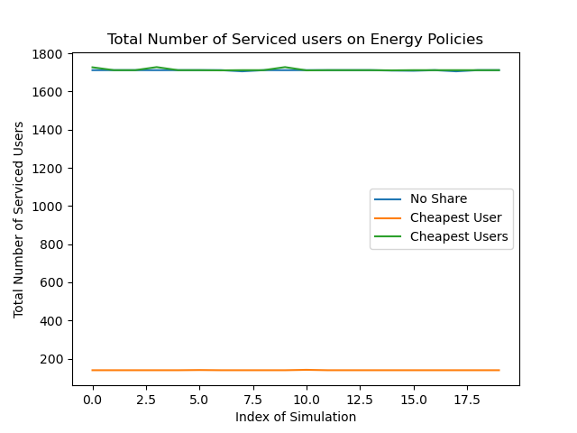
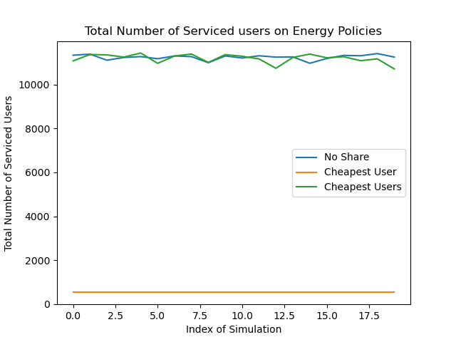

# Revised Proposal
- Revise Project Review Form (Max 8 pages)
    - Title of Project : Brief Overview (200 word max)
    - Project Description (One page max)
    - Project Plan (Two page max)
    - Adoption of Supervisor and Examiners feedback in session 1 report (Half page mix)

### Comments from previous submission

1. Abstract should come as a single paragraph
    - Summarise work and capture reader's attention with the most important details about methodology and findings
2. Overall good introduction
3. Good summary of research papers
    -  Identified the research gaps in the literature and present them clearly
4. Number the equations and refer in the text
5. Figures not clear enough, use high dip figures
6. Compare results with the state of the art and present the comparison will add more value to your outcome
7. Overall good research

# Contact Hours
- Innovation exhibition with poster presentation
- Thesis Seminars on Monday/ Tuesday Week 14
- Workload 24 hours a week

# Final Thesis Report
- Turn tin Check
- Zip file containing all materials

# Simulator

## Description
For each user to satisfy $-60$ dBm, the required received power (Watts) is:

$Pr = 1 * 10^{\frac{-60}{10}} = 1 * 10^{-9} W$

Transmit Power Required to service this user:

$$Pu = Pr * d^{\alpha}$$

If this transmit power is maintained for 5 minutes, energy consumption would be (Joules):

$$E_c = Pu * 60 * 5$$

$5.3$ Watt-hour of power is used when the access point is ON regardless of users being serviced. This would be $19080 J$ every hour and $1590 J$ every 5 minutes.

Energy harvesting is taken from a normal distribution of a certain mean and variance depending on weather condition. 

As an example, this would be $4.21 mW/cm^2$.
If the panel size is $5 cm^2$, the energy arrival will be:

$$4.21 * 5 = 21.05 mW$$

and also equal to $0.02105 W$ which is $0.02105 J/s$. Thus over the 5 minutes, total energy generation will be $6.315 J$

## TODO
- [ ] Basic plot without energy sharing
- [ ] Enable Energy Sharing

## Feature Plan
- [ ] Average Energy Consumption Model
    - [ ] Find out on average the energy consumption model and pick from a distribution
- [x] Transmission Policy
    - [x] Picking cheapest user and only transmitting once
    - [x] Picking cheapest users and transmitting until there is no more energy
    - [ ] Reinforced learning
- [ ] Energy Sharing
    - [ ] Sending a fixed amount of energy per slot to the smart grid
        - Efficiency value
        - Energy arrival rate
        - Consumption
        - Even distribution
    - [ ] Collaboration of access points
        - [ ] Prioritising total of users serviced as a whole
        - [ ] Prioritising users connected to it
        - Borrowing scheme

# Plots

## Energy Policy Comparisons

Access points which do not use any energy consumption policy performs similarly to Access Points that try to service the cheapest users.

When Idle Energy Consumption is low, number of serviced users are affected more by the energy consumption policy.

